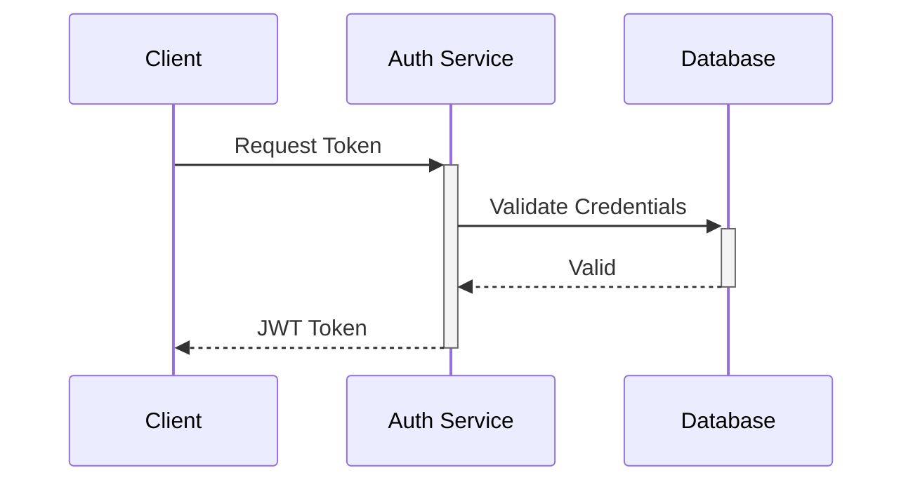
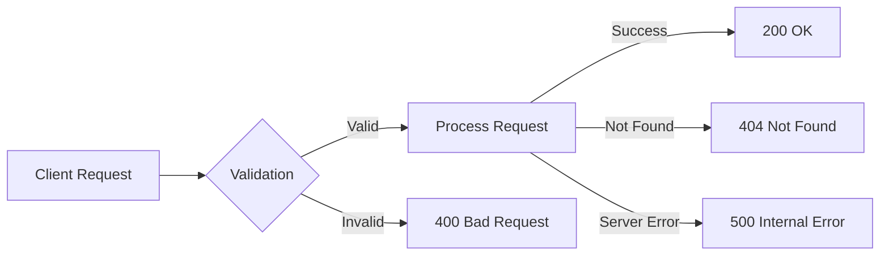

# [ PROJECT NAME ] - API Specification
*Version: 1.0.0*

## API Overview
Brief description of your API's purpose and core functionality.

## Base URL
```
https://api.[your-domain].com/v1
```

## Authentication


## API Endpoints

### User Management
#### POST /users
Create a new user

**Request Body**
```json
{
    "email": "string",
    "password": "string",
    "name": "string"
}
```

**Response**
```json
{
    "id": "string",
    "email": "string",
    "name": "string",
    "created_at": "timestamp"
}
```

### Image Processing

```typescript
// Upload Image
POST /api/v1/images
Content-Type: multipart/form-data
{
    file: File,
    options?: {
        preprocessing?: string[],
        detection_confidence?: number
    }
}
Response: {
    image_id: string,
    status: string,
    task_id: string
}

// Get Image Status
GET /api/v1/images/{image_id}
Response: {
    id: string,
    status: string,
    symbols_detected: number,
    error?: string
}

// Get Image Symbols
GET /api/v1/images/{image_id}/symbols
Response: {
    symbols: Symbol[],
    metadata: {
        total: number,
        confidence_avg: number
    }
}
```

### Symbol Management

```typescript
// Symbol Types
interface Symbol {
    id: string;
    representation: {
        type: 'svg' | 'png' | 'coordinates' | 'unicode';
        data: string | Uint8Array | Point[];
    };
    boundingBox: {
        x: number;
        y: number;
        width: number;
        height: number;
        rotation: number;
    };
    confidence: number;
    metadata: Record<string, any>;
}

// GET /api/v1/symbols
// List symbols with optional filters
interface ListSymbolsRequest {
    cipher_image_id?: string;
    confidence_threshold?: number;
    limit?: number;
    offset?: number;
}

// GET /api/v1/symbols/{symbol_id}
// Get single symbol details
interface GetSymbolResponse {
    symbol: Symbol;
    relationships: {
        similar: Symbol[];
        variants: Symbol[];
        patterns: {
            id: string;
            type: string;
            symbols: Symbol[];
        }[];
    };
}

// POST /api/v1/symbols/analyze
// Analyze relationships between symbols
interface AnalyzeSymbolsRequest {
    symbols: string[];  // Symbol IDs
    analysis_type: 'similarity' | 'pattern' | 'variant';
    parameters?: {
        confidence_threshold?: number;
        max_results?: number;
    };
}
```

### Pattern Analysis

```typescript
// Pattern Types
interface Pattern {
    id: string;
    type: 'sequence' | 'group' | 'repetition';
    symbols: Symbol[];
    frequency: number;
    confidence: number;
    metadata: Record<string, any>;
}

// POST /api/v1/patterns/detect
// Detect patterns in symbol set
interface DetectPatternsRequest {
    cipher_image_id: string;
    parameters: {
        min_length?: number;
        max_length?: number;
        min_frequency?: number;
        confidence_threshold?: number;
    };
}

// GET /api/v1/patterns/{pattern_id}/similar
// Find similar patterns
interface SimilarPatternsRequest {
    confidence_threshold?: number;
    max_results?: number;
}
```

### Analysis Operations

```typescript
// Start Analysis
POST /api/v1/analysis
{
    type: string,
    parameters: {
        pattern_types?: string[],
        min_confidence?: number,
        context_window?: number
    }
}
Response: {
    analysis_id: string,
    status: string,
    estimated_time: number
}

// Get Analysis Results
GET /api/v1/analysis/{analysis_id}
Response: {
    results: AnalysisResult[],
    metadata: {
        type: string,
        duration: number,
        pattern_count: number
    }
}

// Get Pattern Details
GET /api/v1/patterns/{pattern_id}
Response: {
    pattern: Pattern,
    similar_patterns: Pattern[],
    confidence: number
}
```

## Error Handling


### Error Codes
| Code | Description |
|------|-------------|
| 400  | Bad Request |
| 401  | Unauthorized |
| 403  | Forbidden |
| 404  | Not Found |
| 500  | Internal Server Error |

## Rate Limiting
- Image Upload: 10 requests/minute
- Analysis Operations: 20 requests/minute
- Symbol Queries: 100 requests/minute
- WebSocket Messages: 1000 messages/minute

## Versioning
...

## Security
...

## Testing
Endpoint testing guidelines and examples.