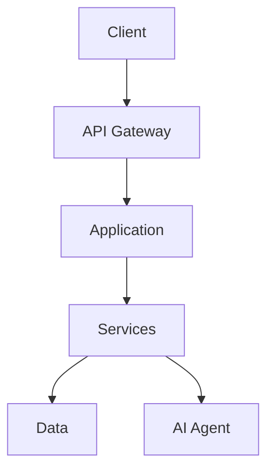
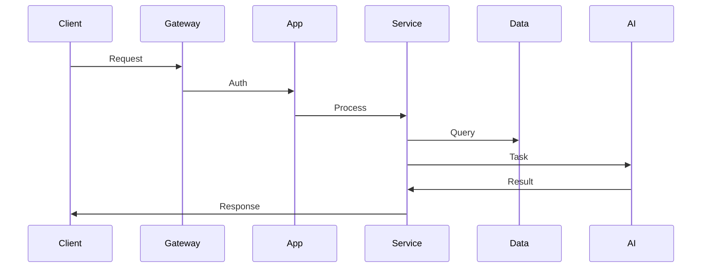

# [ PROJECT NAME ] - Architecture
*Version: 1.0.0*

## System Components

## Core Layers

### Client
- Web Interface
- Mobile Apps
- API Clients

### Gateway
- Authentication
- Rate Limiting
- Routing

### Application
- Business Logic
- Workflows
- Events

### Services
- Core Services
- Integrations
- Message Queue

### Data
- Database
- Cache
- Storage

### AI Agent
- Eliza Framework
- NLP
- Context
- Knowledge Base

## Data Flow

## Security
- Authentication
- Authorization
- Encryption
- Audit Logs

## Scaling
- Load Balancing
- Replication
- Sharding
- Caching

## Monitoring
- Health Metrics
- Error Tracking
- Analytics
- Alerts
