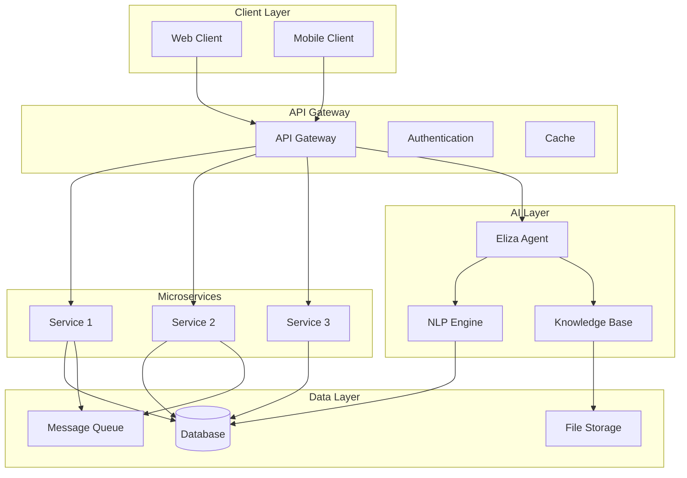
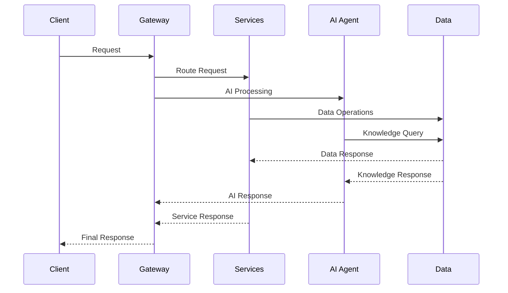

# [ PROJECT NAME ] - Architecture
*Version: 1.0.0*

## System Components

## Core Layers

### Client Layer
- Web Interface (Next.js)
- Mobile Apps (React Native)
- API Clients

### Gateway Layer
- Authentication & Authorization
- Rate Limiting & Caching
- Request Routing & Load Balancing

### Service Layer
- Core Business Logic
- Event Processing
- External Integrations

### AI Layer
- Eliza Framework Integration
- Natural Language Processing
- Knowledge Management
- Context Handling

### Data Layer
- PostgreSQL Database
- Redis Cache
- Object Storage
- Message Queue

## Data Flow

## Security
- Authentication
- Authorization
- Encryption
- Audit Logs

## Scaling
- Load Balancing
- Replication
- Sharding
- Caching

## Monitoring
- Health Metrics
- Error Tracking
- Analytics
- Alerts
