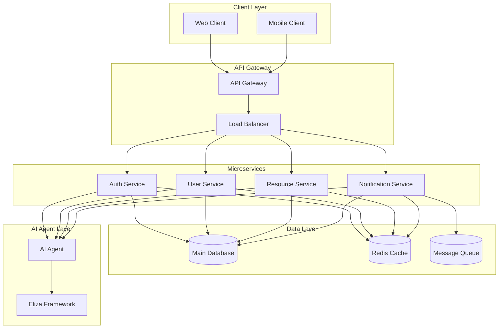
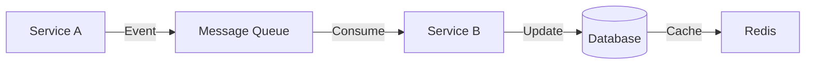
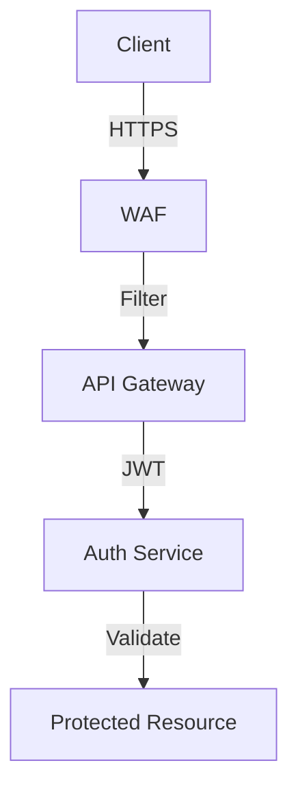

# [ PROJECT NAME ] - Architecture
*Version: 1.0.1*

## System Overview

## Architecture Components

### 1. Client Layer
- Web Application (React/Next.js)
- Mobile Applications
- Third-party Integrations

### 2. API Gateway
- Request Routing
- Authentication
- Rate Limiting
- Load Balancing
- API Documentation

### 3. Microservices

#### Core Services
- Authentication Service
- User Management Service
- Resource Service
- Notification Service

### 4. Data Layer
- Primary Database (PostgreSQL)
- Caching Layer (Redis)
- Message Queue (RabbitMQ/Kafka)
- File Storage (S3/MinIO)

### 5. AI Agent Layer
- Eliza Framework
- Natural Language Processing
- Context Management
- Knowledge Base

## Communication Patterns

### 1. Synchronous
- REST APIs
- GraphQL (where applicable)
- gRPC (internal services)

### 2. Asynchronous
- Event-driven messaging
- Pub/Sub patterns
- Message queues

## Security Architecture

### Security Measures
- JWT Authentication
- Role-based Access Control
- API Key Management
- Rate Limiting
- Request Validation

## Deployment Architecture

### Development
...

### Staging
...

### Production
...

## Monitoring & Logging

### Metrics
- Service Health
- Response Times
- Error Rates
- Resource Usage

### Logging
- Centralized Logging
- Log Levels
- Audit Trails

## Scaling Strategy

### Horizontal Scaling
- Service Replication
- Load Balancing
- Database Sharding

### Vertical Scaling
- Resource Allocation
- Performance Optimization
- Caching Strategies

## Disaster Recovery

### Backup Strategy
...

### Recovery Process
...

## Performance Considerations

### Caching Strategy
- Application Cache
- Database Cache
- CDN Integration

### Optimization
- Query Optimization
- Asset Optimization
- Network Optimization
