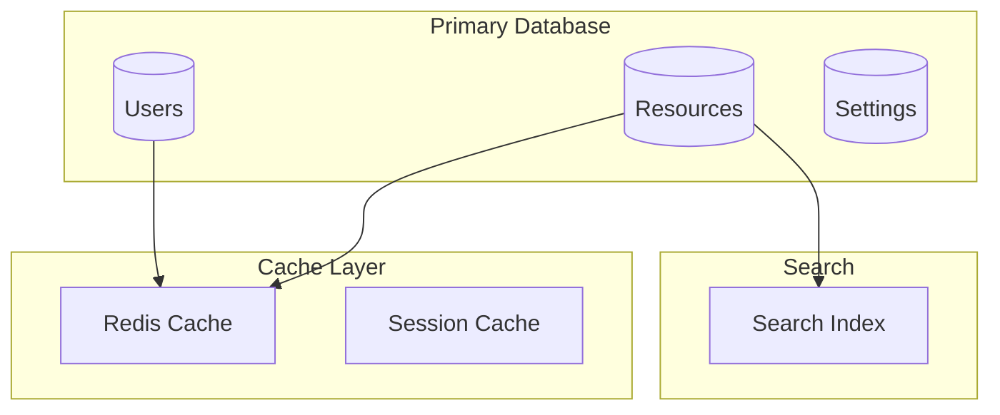

# [ PROJECT NAME ] - Data Model & Storage Strategy
*Version: 1.0.0*

## Database Architecture



## Database Schema

### Users Table
```sql
CREATE TABLE users (
    id UUID PRIMARY KEY,
    email VARCHAR(255) UNIQUE NOT NULL,
    password_hash VARCHAR(255) NOT NULL,
    name VARCHAR(100),
    created_at TIMESTAMP DEFAULT CURRENT_TIMESTAMP,
    updated_at TIMESTAMP DEFAULT CURRENT_TIMESTAMP,
    last_login TIMESTAMP,
    status VARCHAR(20) DEFAULT 'active',
    settings JSONB
);

CREATE INDEX idx_users_email ON users(email);
```

### Resources Table
```sql
CREATE TABLE resources (
    id UUID PRIMARY KEY,
    user_id UUID REFERENCES users(id),
    type VARCHAR(50) NOT NULL,
    name VARCHAR(255) NOT NULL,
    description TEXT,
    metadata JSONB,
    created_at TIMESTAMP DEFAULT CURRENT_TIMESTAMP,
    updated_at TIMESTAMP DEFAULT CURRENT_TIMESTAMP,
    status VARCHAR(20) DEFAULT 'active'
);

CREATE INDEX idx_resources_user_id ON resources(user_id);
CREATE INDEX idx_resources_type ON resources(type);
```

### Settings Table
```sql
CREATE TABLE settings (
    id UUID PRIMARY KEY,
    key VARCHAR(100) UNIQUE NOT NULL,
    value JSONB NOT NULL,
    description TEXT,
    created_at TIMESTAMP DEFAULT CURRENT_TIMESTAMP,
    updated_at TIMESTAMP DEFAULT CURRENT_TIMESTAMP
);

CREATE INDEX idx_settings_key ON settings(key);
```

## Caching Strategy

### Redis Cache Structure
```typescript
interface CacheConfig {
    // User Session Cache
    userSession: {
        key: `user:${userId}:session`,
        ttl: 3600 // 1 hour
    },
    
    // Resource Cache
    resource: {
        key: `resource:${resourceId}`,
        ttl: 1800 // 30 minutes
    },
    
    // Settings Cache
    settings: {
        key: `settings:${key}`,
        ttl: 7200 // 2 hours
    }
}
```

## Data Access Patterns

### User Data
```typescript
interface UserAccess {
    // Create new user
    create: (userData: UserInput) => Promise<User>;
    
    // Retrieve user by ID
    getById: (id: string) => Promise<User>;
    
    // Update user data
    update: (id: string, data: Partial<User>) => Promise<User>;
    
    // Delete user
    delete: (id: string) => Promise<void>;
}
```

### Resource Data
```typescript
interface ResourceAccess {
    // Create new resource
    create: (resourceData: ResourceInput) => Promise<Resource>;
    
    // Get resources by user
    getByUser: (userId: string) => Promise<Resource[]>;
    
    // Update resource
    update: (id: string, data: Partial<Resource>) => Promise<Resource>;
    
    // Delete resource
    delete: (id: string) => Promise<void>;
}
```

## Data Migration

### Migration Strategy
1. Schema Version Control
2. Data Backup
3. Rollback Plan
4. Data Validation

### Migration Scripts
```sql
-- Example migration
CREATE MIGRATION AddUserPreferences
BEGIN
    ALTER TABLE users
    ADD COLUMN preferences JSONB DEFAULT '{}';
    
    CREATE INDEX idx_users_preferences ON users USING gin (preferences);
END;
```

## Backup Strategy

### Backup Types
1. Full Database Backup
2. Incremental Backup
3. Point-in-Time Recovery
4. Transaction Log Backup

### Backup Schedule
- Daily: Full backup
- Hourly: Incremental backup
- Continuous: Transaction log backup

## Data Security

### Encryption
- Data at Rest
- Data in Transit
- Sensitive Data Handling

### Access Control
- Role-Based Access
- Row-Level Security
- Column-Level Encryption

## Performance Optimization

### Indexing Strategy
```sql
-- Composite Indexes
CREATE INDEX idx_resources_user_type ON resources(user_id, type);

-- Full Text Search
CREATE INDEX idx_resources_search ON resources 
USING gin(to_tsvector('english', name || ' ' || description));
```

### Query Optimization
- Query Planning
- Index Usage
- Cache Utilization

## Monitoring & Maintenance

### Health Metrics
- Query Performance
- Cache Hit Ratio
- Index Usage
- Storage Usage

### Maintenance Tasks
- Index Rebuilding
- Statistics Update
- Vacuum Operations
- Cache Pruning