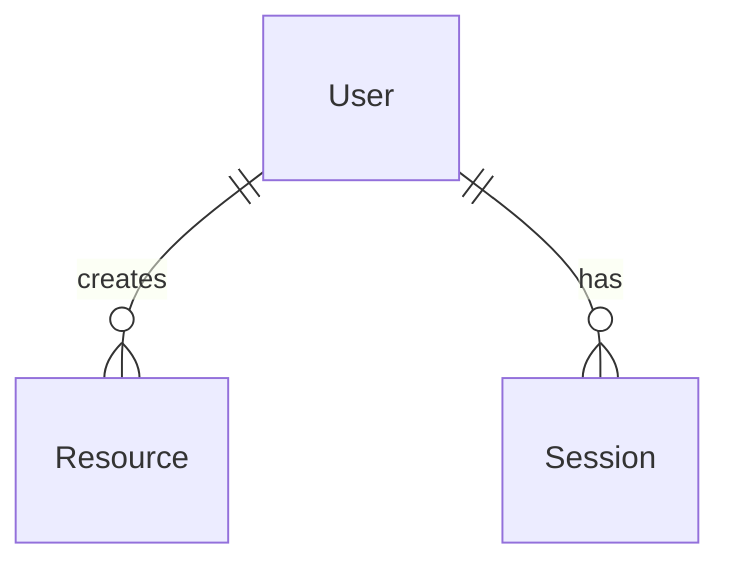

# [ PROJECT NAME ] - Data Model
*Version: 1.0.0*

## Core Entities

### User
```typescript
{
  id: string
  email: string
  name: string
  role: string
  created_at: timestamp
}
```

### Resource
```typescript
{
  id: string
  user_id: string
  type: string
  data: object
  created_at: timestamp
}
```

### Session
```typescript
{
  id: string
  user_id: string
  token: string
  expires_at: timestamp
}
```

## Relationships



## Indexes
- users(email)
- resources(user_id)
- sessions(token)

## Constraints
- Unique email
- Required fields
- Foreign keys
- Cascading deletes

## Storage
- Database: PostgreSQL
- Cache: Redis
- Files: S3