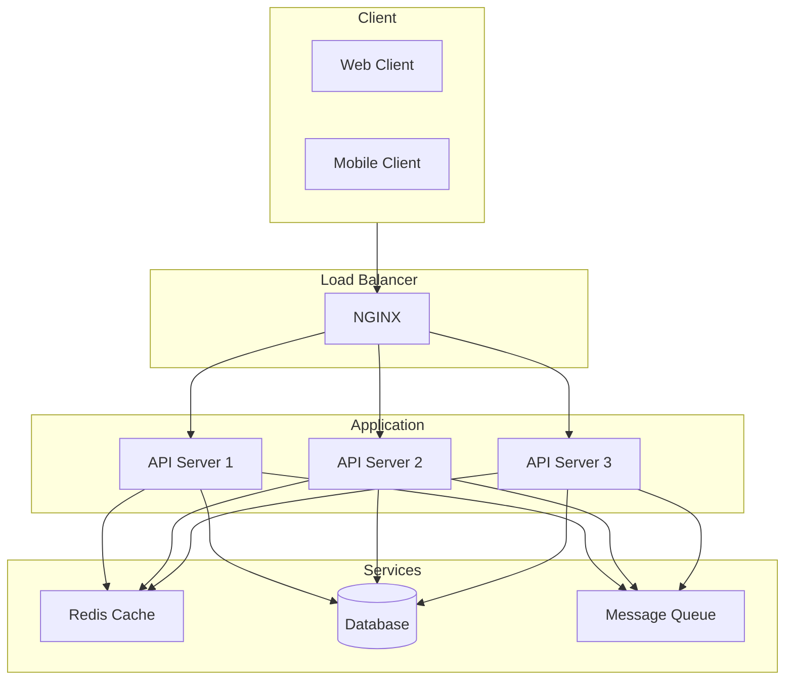
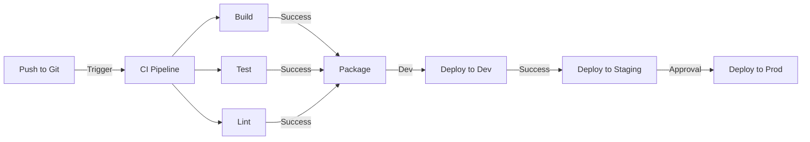
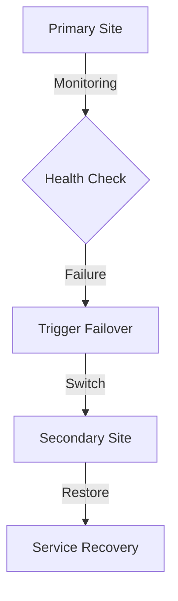

# [ PROJECT NAME ] - Deployment & Operations Guide
*Version: 1.0.0*

## Deployment Architecture



## Environment Setup

### Development
```yaml
# docker-compose.dev.yml
version: '3.8'
services:
  app:
    build:
      context: .
      dockerfile: Dockerfile.dev
    volumes:
      - .:/app
    ports:
      - "3000:3000"
    environment:
      - NODE_ENV=development
      - DATABASE_URL=postgresql://user:pass@db:5432/dbname
      - REDIS_URL=redis://cache:6379

  db:
    image: postgres:latest
    environment:
      - POSTGRES_USER=user
      - POSTGRES_PASSWORD=pass
      - POSTGRES_DB=dbname

  cache:
    image: redis:alpine
```

### Staging
```yaml
# docker-compose.staging.yml
version: '3.8'
services:
  app:
    image: ${REGISTRY}/app:staging
    deploy:
      replicas: 2
    environment:
      - NODE_ENV=staging
      - DATABASE_URL=postgresql://user:pass@db:5432/dbname
      - REDIS_URL=redis://cache:6379

  db:
    image: postgres:latest
    volumes:
      - db_data:/var/lib/postgresql/data

  cache:
    image: redis:alpine
    volumes:
      - cache_data:/data
```

### Production
```yaml
# docker-compose.prod.yml
version: '3.8'
services:
  app:
    image: ${REGISTRY}/app:production
    deploy:
      replicas: 3
      update_config:
        parallelism: 1
        delay: 10s
      restart_policy:
        condition: on-failure
    environment:
      - NODE_ENV=production
      - DATABASE_URL=postgresql://user:pass@db:5432/dbname
      - REDIS_URL=redis://cache:6379

  db:
    image: postgres:latest
    volumes:
      - db_data:/var/lib/postgresql/data
    deploy:
      placement:
        constraints: [node.role == manager]

  cache:
    image: redis:alpine
    volumes:
      - cache_data:/data
```

## CI/CD Pipeline



### GitHub Actions Workflow
```yaml
name: CI/CD Pipeline

on:
  push:
    branches: [ main, develop ]
  pull_request:
    branches: [ main ]

jobs:
  build:
    runs-on: ubuntu-latest
    steps:
      - uses: actions/checkout@v2
      - name: Setup Node.js
        uses: actions/setup-node@v2
        with:
          node-version: '18'
      - name: Install dependencies
        run: npm ci
      - name: Run tests
        run: npm test
      - name: Build
        run: npm run build
```

## Monitoring & Logging

### Prometheus Configuration
```yaml
global:
  scrape_interval: 15s

scrape_configs:
  - job_name: 'app'
    static_configs:
      - targets: ['localhost:3000']

  - job_name: 'node'
    static_configs:
      - targets: ['localhost:9100']
```

### Grafana Dashboard
```json
{
  "dashboard": {
    "panels": [
      {
        "title": "Request Rate",
        "type": "graph",
        "datasource": "Prometheus",
        "targets": [
          {
            "expr": "rate(http_requests_total[5m])"
          }
        ]
      }
    ]
  }
}
```

## Backup Strategy

### Database Backups
```bash
#!/bin/bash
# backup.sh

DATE=$(date +%Y%m%d_%H%M%S)
BACKUP_DIR="/backups"

# Backup database
pg_dump -U $DB_USER -h $DB_HOST $DB_NAME > $BACKUP_DIR/db_$DATE.sql

# Compress backup
gzip $BACKUP_DIR/db_$DATE.sql

# Cleanup old backups (keep last 7 days)
find $BACKUP_DIR -name "db_*.sql.gz" -mtime +7 -delete
```

## Scaling Strategy

### Horizontal Scaling
- Load balancer configuration
- Session management
- Cache synchronization
- Database replication

### Vertical Scaling
- Resource allocation
- Performance tuning
- Memory optimization

## Security Measures

### SSL Configuration
```nginx
# nginx.conf
server {
    listen 443 ssl;
    server_name example.com;

    ssl_certificate /etc/nginx/ssl/cert.pem;
    ssl_certificate_key /etc/nginx/ssl/key.pem;
    ssl_protocols TLSv1.2 TLSv1.3;
    ssl_ciphers HIGH:!aNULL:!MD5;
}
```

### Firewall Rules
```bash
# Allow HTTP/HTTPS
ufw allow 80/tcp
ufw allow 443/tcp

# Allow SSH only from specific IPs
ufw allow from 192.168.1.0/24 to any port 22
```

## Disaster Recovery

### Recovery Plan
1. System Assessment
2. Backup Restoration
3. Service Verification
4. Performance Validation

### Failover Strategy


## Performance Optimization

### Caching Strategy
- Application caching
- Database query caching
- Static asset caching
- CDN integration

### Load Testing
```bash
# k6 load test script
k6 run --vus 10 --duration 30s load-test.js
```

## Maintenance Procedures

### Deployment Checklist
- [ ] Backup verification
- [ ] Dependencies update
- [ ] Security patches
- [ ] Performance check
- [ ] Monitoring setup

### Rollback Procedure
1. Version identification
2. Backup confirmation
3. Service shutdown
4. State restoration
5. Service verification