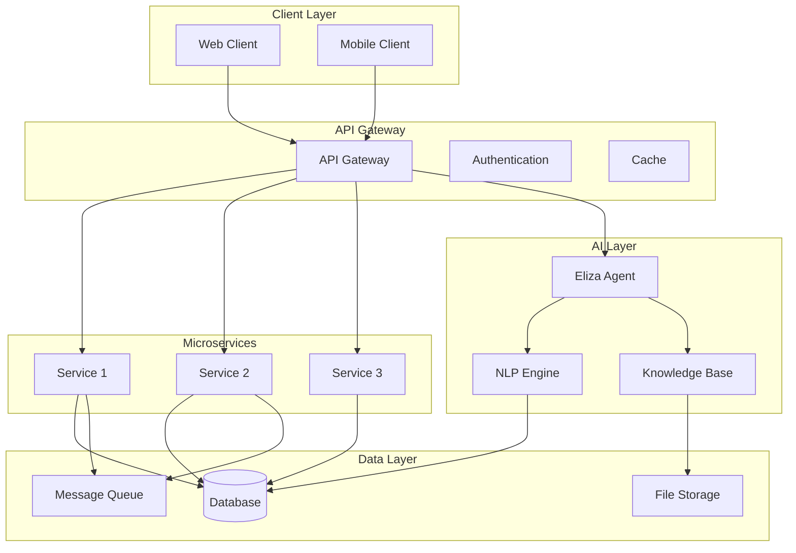
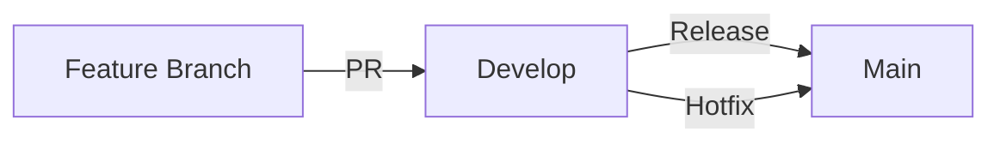
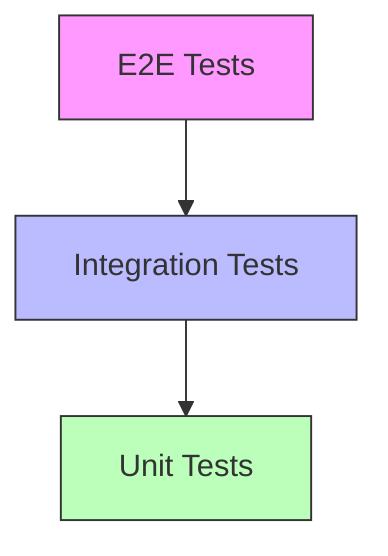

# [ PROJECT NAME ]
*Version: 1.0.1*

## Overview
Brief description of the project, its purpose, and key features.

## Vision
High-level vision and goals for the project.

## Key Features
- Feature 1: Description
- Feature 2: Description
- Feature 3: Description

## System Architecture



## Technology Stack

### Frontend
- Framework: Next.js
- UI Library: React
- State Management: Redux/Zustand
- Styling: Tailwind CSS
- Testing: Jest, React Testing Library

### Backend
- Runtime: Node.js
- Framework: NestJS/FastAPI
- API: REST/GraphQL
- Database: PostgreSQL
- Cache: Redis
- Message Queue: RabbitMQ

### Infrastructure
- Cloud: AWS/GCP
- Containers: Docker
- Orchestration: Kubernetes
- CI/CD: GitHub Actions
- Monitoring: Prometheus/Grafana

## Project Structure
```
project-root/
├── frontend/           # Frontend application
├── backend/            # Backend services
├── ai/                 # AI agent components
├── infrastructure/     # IaC and deployment
├── docs/              # Documentation
└── scripts/           # Utility scripts
```

## Development Setup

### Prerequisites
- Node.js v18+
- Docker
- Git
- IDE (VS Code recommended)

### Quick Start
```bash
# Clone repository
git clone https://github.com/org/project.git

# Install dependencies
npm install

# Start development environment
npm run dev
```

## Development Workflow

### Git Flow


### Branching Strategy
- main: Production releases
- develop: Integration branch
- feature/*: New features
- hotfix/*: Production fixes

## Testing Strategy

### Test Pyramid


### Test Coverage
- Unit Tests: 80%
- Integration Tests: 60%
- E2E Tests: Key user flows

## Deployment

### Environments
- Development: For active development
- Staging: For QA and testing
- Production: Live environment

### Release Process
1. Code Review
2. Automated Tests
3. Manual QA
4. Staging Deployment
5. Production Release

## Monitoring & Metrics

### Key Metrics
- Response Time
- Error Rate
- Resource Usage
- User Activity

### Alerting
- Service Health
- Performance Thresholds
- Security Events
- Business Metrics

## Security

### Standards
- OWASP Guidelines
- Data Encryption
- Access Control
- Audit Logging

### Compliance
- GDPR
- CCPA
- SOC 2
- ISO 27001

## Documentation

### Technical Docs
- API Reference
- Architecture Guide
- Development Guide
- Deployment Guide

### User Docs
- User Guide
- Admin Guide
- FAQ
- Troubleshooting

## Support & Maintenance

### Support Channels
- GitHub Issues
- Support Email
- Documentation
- Community Forum

### Maintenance Schedule
- Security Updates: ASAP
- Bug Fixes: Weekly
- Feature Updates: Monthly
- Major Releases: Quarterly

## Contributing

### Guidelines
1. Fork the repository
2. Create feature branch
3. Follow code style
4. Add tests
5. Submit PR

### Code Review
- Automated checks
- Peer review
- Documentation review
- Security review

## License
[License Type] - See LICENSE file for details

## Contact
- Project Lead: [Name]
- Technical Lead: [Name]
- Support: support@example.com
