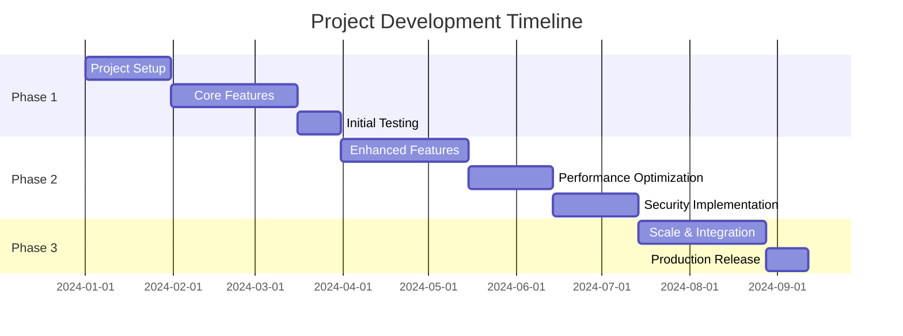

# [ PROJECT NAME ] - Development Roadmap
*Version: 1.0.0*

## Project Timeline

## Phase 1: Foundation (Q1 2024)

### Project Setup
- [ ] Repository setup
- [ ] Development environment
- [ ] CI/CD pipeline
- [ ] Documentation structure

### Core Features
- [ ] User authentication
- [ ] Basic CRUD operations
- [ ] Data models
- [ ] API endpoints

### Initial Testing
- [ ] Unit tests
- [ ] Integration tests
- [ ] Performance benchmarks
- [ ] Security audit

## Phase 2: Enhancement (Q2 2024)

### Enhanced Features
- [ ] Advanced search
- [ ] Real-time updates
- [ ] Analytics dashboard
- [ ] Export functionality

### Performance Optimization
- [ ] Database optimization
- [ ] Caching implementation
- [ ] Load balancing
- [ ] CDN integration

### Security Implementation
- [ ] OAuth integration
- [ ] Rate limiting
- [ ] Data encryption
- [ ] Security monitoring

## Phase 3: Scale & Production (Q3 2024)

### Scale & Integration
- [ ] Microservices architecture
- [ ] Message queues
- [ ] Third-party integrations
- [ ] Monitoring system

### Production Release
- [ ] Production environment
- [ ] Documentation
- [ ] User training
- [ ] Support system

## Future Considerations

### Q4 2024
- Mobile application
- AI/ML features
- Blockchain integration
- International support

### 2025
- Enterprise features
- Advanced analytics
- Custom integrations
- Extended API support

## Release Schedule

### v1.0.0 (Q1 2024)
- Core functionality
- Basic features
- Initial testing

### v2.0.0 (Q2 2024)
- Enhanced features
- Performance improvements
- Security updates

### v3.0.0 (Q3 2024)
- Scaling capabilities
- Full integration
- Production release

## Success Metrics

### Technical Metrics
- Response time < 100ms
- 99.9% uptime
- <1% error rate
- 100% test coverage

### Business Metrics
- User adoption rate
- Customer satisfaction
- Revenue growth
- Market share

## Risk Assessment

### Technical Risks
- Technology stack stability
- Scalability challenges
- Integration complexity
- Security vulnerabilities

### Business Risks
- Market competition
- Resource constraints
- Regulatory compliance
- User adoption

## Resource Planning

### Development Team
- Frontend developers
- Backend developers
- DevOps engineers
- QA engineers

### Infrastructure
- Cloud resources
- Development tools
- Testing environment
- Monitoring systems

## Budget Allocation

### Development
- Team salaries
- Tools and licenses
- Training and education
- External consultants

### Infrastructure
- Cloud services
- Security tools
- Third-party services
- Maintenance costs

## Stakeholder Communication

### Internal Updates
- Weekly team meetings
- Monthly progress reports
- Quarterly reviews
- Documentation updates

### External Communication
- Release announcements
- Feature updates
- Security advisories
- Support channels

## Dependencies

### Internal Dependencies
- Team availability
- Resource allocation
- Technical expertise
- Budget approval

### External Dependencies
- Third-party services
- API providers
- Cloud platforms
- Regulatory compliance

## Contingency Plans

### Technical Issues
- Backup systems
- Failover procedures
- Data recovery
- Alternative solutions

### Business Continuity
- Resource reallocation
- Priority adjustment
- Alternative vendors
- Emergency procedures
