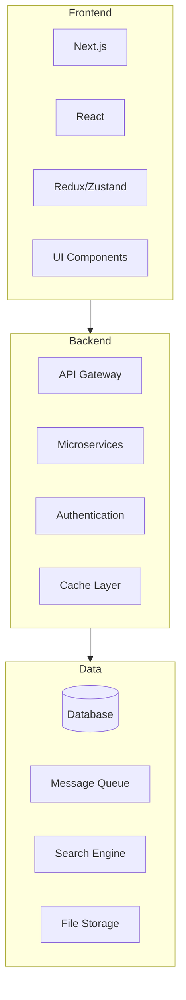

# [ PROJECT NAME ] - Technology Stack
*Version: 1.0.0*

## Architecture Overview

## Frontend Technologies

### Core Framework
- Next.js v14
- React v18
- TypeScript v5
- Tailwind CSS v3

### State Management
- Redux Toolkit/Zustand
- React Query
- Context API

### UI Components
- shadcn/ui v1
- Accessible components
- Dark mode support

## Backend Technologies

### API Framework
- NestJS v10
- OpenAPI/Swagger
- WebSocket support

### Database
- PostgreSQL v16
- Prisma v5
- Redis v7

### Message Queue
- RabbitMQ v3

## AI/ML Technologies

### Framework
- Eliza
- TensorFlow/PyTorch
- Custom Models

## DevOps

### Infrastructure
- Docker
- Kubernetes
- AWS/GCP

### CI/CD
- GitHub Actions
- Jenkins
- ArgoCD

### Monitoring
- Prometheus
- Grafana
- ELK Stack