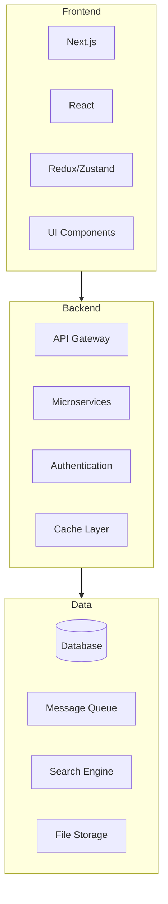

# [ PROJECT NAME ] - Technology Stack
*Version: 1.0.0*

## Architecture Overview



## Frontend Technologies

### Core Framework
- **Next.js** v14.x
  - Server-side rendering
  - API routes
  - File-based routing
  - Image optimization

### UI Framework
- **React** v18.x
  - Functional components
  - React hooks
  - Context API
  - Suspense

### State Management
- **Redux Toolkit** v2.x
  - RTK Query
  - Redux Thunk
  - Redux DevTools
- **Zustand** v4.x
  - Lightweight state
  - Middleware support

### UI Components
- **Tailwind CSS** v3.x
  - JIT compiler
  - Custom themes
  - Responsive design
- **shadcn/ui** v1.x
  - Accessible components
  - Dark mode
  - Customizable themes

### Development Tools
- **TypeScript** v5.x
- **ESLint**
- **Prettier**
- **Husky**

## Backend Technologies

### API Framework
- **NestJS** v10.x
  - Modular architecture
  - Dependency injection
  - OpenAPI/Swagger
  - WebSocket support

### Database
- **PostgreSQL** v16.x
  - JSONB support
  - Full-text search
  - Partitioning
- **Prisma** v5.x
  - Type-safe ORM
  - Migrations
  - Query builder

### Caching
- **Redis** v7.x
  - Session storage
  - Caching layer
  - Rate limiting
  - Pub/sub

### Message Queue
- **RabbitMQ** v3.x
  - Message broker
  - Event bus
  - Dead letter queue
  - Priority queues

## Infrastructure

### Cloud Platform
- **AWS**
  - ECS/EKS
  - RDS
  - S3
  - CloudFront
  - Route53

### Container Orchestration
- **Docker** v24.x
- **Kubernetes** v1.28.x
  - Auto-scaling
  - Load balancing
  - Service mesh
  - Secret management

### CI/CD
- **GitHub Actions**
  - Automated testing
  - Build pipeline
  - Deployment
  - Security scanning

### Monitoring
- **Prometheus**
  - Metrics collection
  - Alert rules
  - Time series DB
- **Grafana**
  - Dashboards
  - Alerting
  - Visualization

## Development Environment

### IDE
- **VS Code**
  - Extensions
  - Debugging
  - Git integration
  - Live Share

### Version Control
- **Git**
  - GitHub
  - Branch protection
  - Code review
  - Actions

### Testing
- **Jest**
  - Unit testing
  - Integration tests
  - Snapshot testing
- **Cypress**
  - E2E testing
  - Component testing
  - Visual testing

### Documentation
- **TypeDoc**
- **Swagger/OpenAPI**
- **Markdown**
- **Mermaid**

## Security

### Authentication
- **NextAuth.js**
  - OAuth providers
  - JWT tokens
  - Session management
- **Passport.js**
  - Strategies
  - Middleware

### Authorization
- **CASL**
  - Role-based access
  - Attribute-based access
  - Policy management

### API Security
- **Helmet**
- **CORS**
- **Rate limiting**
- **Input validation**

## Development Tools

### Package Management
- **pnpm**
  - Workspace support
  - Fast installation
  - Disk efficient

### Build Tools
- **Webpack**
- **Vite**
- **SWC**
- **Turbopack**

### Code Quality
- **SonarQube**
  - Code analysis
  - Quality gates
  - Security scanning
- **Dependabot**
  - Dependency updates
  - Security alerts

## Version Requirements

### Node.js
```json
{
  "engines": {
    "node": ">=18.0.0",
    "pnpm": ">=8.0.0"
  }
}
```

### Database
```yaml
database:
  postgres: ">=16.0"
  redis: ">=7.0"
```

### Container
```yaml
containers:
  docker: ">=24.0"
  kubernetes: ">=1.28"
```

## Dependencies

### Production Dependencies
```json
{
  "dependencies": {
    "next": "^14.0.0",
    "react": "^18.0.0",
    "nestjs": "^10.0.0",
    "prisma": "^5.0.0"
  }
}
```

### Development Dependencies
```json
{
  "devDependencies": {
    "typescript": "^5.0.0",
    "jest": "^29.0.0",
    "eslint": "^8.0.0",
    "prettier": "^3.0.0"
  }
}
```

## Performance Optimization

### Frontend
- Code splitting
- Tree shaking
- Image optimization
- Lazy loading

### Backend
- Query optimization
- Connection pooling
- Caching strategy
- Load balancing

### Database
- Indexing strategy
- Query optimization
- Partitioning
- Replication

## Scalability

### Horizontal Scaling
- Stateless services
- Load balancing
- Session management
- Database sharding

### Vertical Scaling
- Resource optimization
- Memory management
- Connection pooling
- Query optimization

## Maintenance

### Updates
- Security patches
- Dependency updates
- Version upgrades
- Performance tuning

### Monitoring
- System metrics
- Error tracking
- Performance monitoring
- User analytics