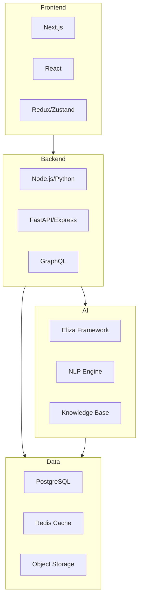

# [ PROJECT NAME ] - Technology Stack
*Version: 1.0.1*

## Architecture Overview

## Frontend Stack
- **Framework**: Next.js 14
- **UI Library**: React 18
- **State Management**: Redux/Zustand
- **Styling**: Tailwind CSS
- **Components**: shadcn/ui

## Backend Stack
- **Runtime**: Node.js 20 / Python 3.11
- **Framework**: Express / FastAPI
- **API**: REST / GraphQL
- **Authentication**: JWT / OAuth2

## AI Stack
- **Framework**: Eliza
- **NLP**: spaCy/NLTK
- **Knowledge Base**: Vector DB
- **Context**: MCP Protocol

## Data Stack
- **Database**: PostgreSQL 16
- **Cache**: Redis
- **Storage**: S3/MinIO
- **Queue**: RabbitMQ

## DevOps
- **Containers**: Docker
- **Orchestration**: Kubernetes
- **CI/CD**: GitHub Actions
- **Monitoring**: Prometheus/Grafana