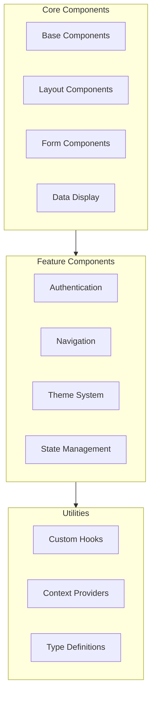

# [ PROJECT NAME ] - UI Implementation Guide
*Version: 1.0.1*

## Component Architecture



## Component Implementation

### Base Components
```typescript
// Generic Button Component
interface ButtonProps {
  variant: 'primary' | 'secondary' | 'ghost';
  size: 'sm' | 'md' | 'lg';
  children: React.ReactNode;
  onClick?: () => void;
  disabled?: boolean;
  className?: string;
  ariaLabel?: string;
}

const Button = ({
  variant,
  size,
  children,
  onClick,
  disabled,
  className,
  ariaLabel
}: ButtonProps) => {
  const baseStyles = 'rounded-md font-medium transition-colors focus:ring-2';
  const variantStyles = {
    primary: 'bg-primary-500 text-white hover:bg-primary-600',
    secondary: 'bg-secondary-500 text-primary-900 hover:bg-secondary-600',
    ghost: 'hover:bg-primary-100 text-primary-900'
  };
  const sizeStyles = {
    sm: 'px-2 py-1 text-sm',
    md: 'px-4 py-2',
    lg: 'px-6 py-3 text-lg'
  };

  return (
    <button
      className={`${baseStyles} ${variantStyles[variant]} ${sizeStyles[size]} ${className}`}
      onClick={onClick}
      disabled={disabled}
      aria-label={ariaLabel}
    >
      {children}
    </button>
  );
};
```

### Layout Components
```typescript
// Generic Page Layout
interface LayoutProps {
  header?: React.ReactNode;
  sidebar?: React.ReactNode;
  footer?: React.ReactNode;
  children: React.ReactNode;
}

const Layout = ({ header, sidebar, footer, children }: LayoutProps) => {
  return (
    <div className="min-h-screen bg-background">
      {header && <header className="sticky top-0 z-10">{header}</header>}
      <div className="flex min-h-[calc(100vh-4rem)]">
        {sidebar && (
          <aside className="w-64 border-r border-border">
            {sidebar}
          </aside>
        )}
        <main className="flex-1 px-4 py-8">
          {children}
        </main>
      </div>
      {footer && <footer className="border-t border-border">{footer}</footer>}
    </div>
  );
};
```

## State Management

### Generic Store
```typescript
interface AppState<T> {
  data: T;
  loading: boolean;
  error: Error | null;
  setData: (data: T) => void;
  setError: (error: Error | null) => void;
  setLoading: (loading: boolean) => void;
}

const createStore = <T>(initialData: T) => {
  return create<AppState<T>>((set) => ({
    data: initialData,
    loading: false,
    error: null,
    setData: (data) => set({ data }),
    setError: (error) => set({ error }),
    setLoading: (loading) => set({ loading })
  }));
};
```

### Context Provider
```typescript
interface AppContextState<T> {
  state: T;
  dispatch: React.Dispatch<AppAction<T>>;
}

const createAppContext = <T,>() => {
  const AppContext = createContext<AppContextState<T> | undefined>(undefined);

  const AppProvider: React.FC<{
    initialState: T;
    children: React.ReactNode;
  }> = ({ initialState, children }) => {
    const [state, dispatch] = useReducer(appReducer, initialState);

    return (
      <AppContext.Provider value={{ state, dispatch }}>
        {children}
      </AppContext.Provider>
    );
  };

  return { AppContext, AppProvider };
};
```

## Styling System

### Theme Configuration
```typescript
// theme.config.ts
export const theme = {
  colors: {
    primary: {
      50: '#f0f9ff',
      100: '#e0f2fe',
      500: '#0ea5e9',
      600: '#0284c7',
      900: '#0c4a6e'
    },
    secondary: {
      50: '#fdf4ff',
      100: '#fae8ff',
      500: '#d946ef',
      600: '#c026d3',
      900: '#701a75'
    },
    background: {
      light: '#ffffff',
      dark: '#1a1a1a'
    },
    text: {
      light: '#1a1a1a',
      dark: '#ffffff'
    }
  },
  spacing: {
    xs: '0.25rem',
    sm: '0.5rem',
    md: '1rem',
    lg: '1.5rem',
    xl: '2rem'
  },
  breakpoints: {
    sm: '640px',
    md: '768px',
    lg: '1024px',
    xl: '1280px'
  }
};
```

## Form Handling

### Generic Form
```typescript
interface FormConfig {
  fields: {
    name: string;
    type: string;
    label: string;
    validation?: {
      required?: boolean;
      pattern?: RegExp;
      minLength?: number;
      maxLength?: number;
    };
  }[];
  onSubmit: (data: any) => void;
}

const GenericForm = ({ fields, onSubmit }: FormConfig) => {
  const form = useForm();

  return (
    <form onSubmit={form.handleSubmit(onSubmit)} className="space-y-4">
      {fields.map((field) => (
        <FormField
          key={field.name}
          {...field}
          register={form.register}
          error={form.formState.errors[field.name]}
        />
      ))}
      <Button type="submit" variant="primary">Submit</Button>
    </form>
  );
};
```

## Data Fetching

### Generic API Client
```typescript
interface APIConfig {
  baseURL: string;
  headers?: Record<string, string>;
  timeout?: number;
}

class APIClient {
  private client: AxiosInstance;

  constructor(config: APIConfig) {
    this.client = axios.create({
      baseURL: config.baseURL,
      headers: {
        'Content-Type': 'application/json',
        ...config.headers
      },
      timeout: config.timeout || 10000
    });

    this.setupInterceptors();
  }

  private setupInterceptors() {
    this.client.interceptors.request.use(
      (config) => {
        const token = localStorage.getItem('token');
        if (token) {
          config.headers.Authorization = `Bearer ${token}`;
        }
        return config;
      },
      (error) => Promise.reject(error)
    );
  }

  async get<T>(url: string, params?: any): Promise<T> {
    const response = await this.client.get<T>(url, { params });
    return response.data;
  }

  async post<T>(url: string, data: any): Promise<T> {
    const response = await this.client.post<T>(url, data);
    return response.data;
  }
}
```

## Error Handling

### Error Boundary
```typescript
interface ErrorBoundaryProps {
  fallback: React.ReactNode;
  children: React.ReactNode;
}

interface ErrorBoundaryState {
  hasError: boolean;
  error?: Error;
}

class ErrorBoundary extends React.Component<
  ErrorBoundaryProps,
  ErrorBoundaryState
> {
  constructor(props: ErrorBoundaryProps) {
    super(props);
    this.state = { hasError: false };
  }

  static getDerivedStateFromError(error: Error) {
    return { hasError: true, error };
  }

  componentDidCatch(error: Error, errorInfo: React.ErrorInfo) {
    console.error('Error caught by boundary:', error, errorInfo);
  }

  render() {
    if (this.state.hasError) {
      return this.props.fallback;
    }

    return this.props.children;
  }
}
```

## Performance Optimization

### Generic Virtualized List
```typescript
interface VirtualListProps<T> {
  items: T[];
  height: number;
  itemHeight: number;
  renderItem: (item: T, index: number) => React.ReactNode;
}

function VirtualList<T>({
  items,
  height,
  itemHeight,
  renderItem
}: VirtualListProps<T>) {
  const [scrollTop, setScrollTop] = useState(0);
  const containerRef = useRef<HTMLDivElement>(null);

  const visibleItems = useMemo(() => {
    const start = Math.floor(scrollTop / itemHeight);
    const end = Math.min(
      start + Math.ceil(height / itemHeight),
      items.length
    );
    return items.slice(start, end).map((item, index) => ({
      item,
      index: start + index
    }));
  }, [items, scrollTop, height, itemHeight]);

  return (
    <div
      ref={containerRef}
      style={{ height, overflow: 'auto' }}
      onScroll={(e) => setScrollTop(e.currentTarget.scrollTop)}
    >
      <div style={{ height: items.length * itemHeight }}>
        {visibleItems.map(({ item, index }) => (
          <div
            key={index}
            style={{
              position: 'absolute',
              top: index * itemHeight,
              height: itemHeight
            }}
          >
            {renderItem(item, index)}
          </div>
        ))}
      </div>
    </div>
  );
}
```

## Accessibility

### Generic Accessible Components
```typescript
// Accessible Modal
interface ModalProps {
  isOpen: boolean;
  onClose: () => void;
  title: string;
  children: React.ReactNode;
}

const Modal = ({ isOpen, onClose, title, children }: ModalProps) => {
  useEffect(() => {
    if (isOpen) {
      document.body.style.overflow = 'hidden';
    }
    return () => {
      document.body.style.overflow = 'unset';
    };
  }, [isOpen]);

  if (!isOpen) return null;

  return (
    <div
      role="dialog"
      aria-modal="true"
      aria-labelledby="modal-title"
      className="fixed inset-0 z-50 flex items-center justify-center"
    >
      <div
        className="fixed inset-0 bg-black/50"
        onClick={onClose}
      />
      <div className="relative bg-background p-6 rounded-lg">
        <h2 id="modal-title" className="text-xl font-bold">
          {title}
        </h2>
        {children}
      </div>
    </div>
  );
};
```

## Testing

### Component Testing
```typescript
// Generic Component Test
describe('Component', () => {
  const setup = (props = {}) => {
    return render(<Component {...props} />);
  };

  it('renders with default props', () => {
    const { container } = setup();
    expect(container).toBeInTheDocument();
  });

  it('handles user interactions', async () => {
    const onAction = jest.fn();
    const { getByRole } = setup({ onAction });
    
    const button = getByRole('button');
    await userEvent.click(button);
    
    expect(onAction).toHaveBeenCalled();
  });

  it('matches snapshot', () => {
    const { container } = setup();
    expect(container).toMatchSnapshot();
  });
});
```
