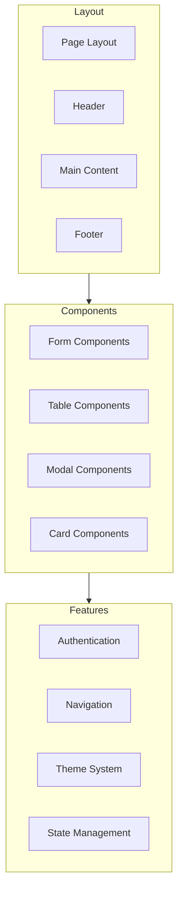

# [ PROJECT NAME ] - UI Implementation Guide
*Version: 1.0.0*

This document provides detailed specifications for recreating the Cipher Analyzer Tool (CAT) user interface, preserving the look and feel of the original implementation while using the updated tech stack.

## Core UI Components

### 1. CipherGrid Component
```typescript
// Dynamic symbol management
interface SymbolDefinition {
  value: string;
  category: string;
  metadata?: {
    type?: string;
    confidence?: number;
    variants?: string[];
  }
}

// Initial symbol sets (extensible)
const DEFAULT_SYMBOL_SETS = {
  alphanumeric: {
    uppercase: 'ABCDEFGHIJKLMNOPQRSTUVWXYZ'.split(''),
    lowercase: 'abcdefghijklmnopqrstuvwxyz'.split(''),
    numbers: '0123456789'.split(''),
    special: '.,;:!?-_+=()[]{}@#$%^&*'.split('')
  },
  geometric: {
    circles: ['●', '○', '⊖', '⊘', '⊕'],
    squares: ['■', '□', '⊟', '⊠', '⊞'],
    triangles: ['▲', '△', '\\']
  },
  custom: new Map<string, SymbolDefinition>()  // For dynamically detected symbols
};

interface CipherGridProps {
  data: Array<{
    symbol: SymbolDefinition;
    position: { row: number; col: number };
    confidence: number;
  }>;
  dimensions: { rows: number; cols: number };
  highlights: Array<{
    positions: Array<{ row: number; col: number }>;
    type: 'pattern' | 'selection' | 'match';
    color?: string;
  }>;
  onCellInteraction: (
    type: 'click' | 'hover' | 'contextmenu',
    position: { row: number; col: number },
    symbol: SymbolDefinition
  ) => void;
  renderOptions?: {
    cellSize?: number;
    fontSize?: number;
    showConfidence?: boolean;
    showGrid?: boolean;
  };
}

// Symbol registry for dynamic management
class SymbolRegistry {
  private symbols: Map<string, SymbolDefinition> = new Map();
  
  registerSymbol(symbol: SymbolDefinition) {
    this.symbols.set(symbol.value, symbol);
  }
  
  registerBatch(symbols: SymbolDefinition[]) {
    symbols.forEach(s => this.registerSymbol(s));
  }
  
  getSymbol(value: string): SymbolDefinition | undefined {
    return this.symbols.get(value);
  }
  
  getByCategory(category: string): SymbolDefinition[] {
    return Array.from(this.symbols.values())
      .filter(s => s.category === category);
  }
}
```

Key Features:
- Dynamic symbol registration and management
- Flexible grid layout with configurable dimensions
- Multiple highlight types for different analysis states
- Confidence level visualization
- Responsive to different symbol sizes and types
- Support for custom symbol sets

### 2. Analysis Panel
```typescript
interface AnalysisResult {
  type: 'frequency' | 'pattern' | 'sequence' | 'custom';
  data: {
    symbols?: Map<string, {
      count: number;
      positions: Array<{ row: number; col: number }>;
      confidence: number;
    }>;
    patterns?: Array<{
      sequence: string[];
      occurrences: number;
      positions: Array<{ row: number; col: number }[]>;
      confidence: number;
    }>;
    custom?: any;
  };
  metadata: {
    timestamp: string;
    duration: number;
    algorithm: string;
    confidence: number;
  };
}

interface AnalysisPanelProps {
  results: AnalysisResult[];
  isLoading: boolean;
  onResultSelect: (result: AnalysisResult) => void;
  filters: {
    minConfidence: number;
    categories: string[];
    timeRange: [Date, Date];
  };
}
```

### 3. Real-Time Updates
```typescript
interface WSMessage {
  type: 'update' | 'error' | 'complete';
  priority: 'critical' | 'standard' | 'low';
  timestamp: string;
  payload: {
    message: string;
    data?: {
      symbols?: SymbolDefinition[];
      analysis?: AnalysisResult;
      progress?: number;
    };
    status?: ProcessStatus;
  };
}

class AnalysisStreamManager {
  private ws: WebSocket;
  private messageQueue: WSMessage[] = [];
  private symbolRegistry: SymbolRegistry;
  
  constructor(url: string, symbolRegistry: SymbolRegistry) {
    this.ws = new WebSocket(url);
    this.symbolRegistry = symbolRegistry;
    this.initializeWebSocket();
  }
  
  private handleSymbolUpdate(symbols: SymbolDefinition[]) {
    this.symbolRegistry.registerBatch(symbols);
    // Trigger UI updates
  }
  
  private handleAnalysisUpdate(analysis: AnalysisResult) {
    // Process and display analysis results
  }
}
```

## Symbol Management Integration

The UI components integrate with the Symbol Management System (SMS) as defined in `SYMBOL-MANAGEMENT.md`. Key integration points:

### CipherGrid Integration
```typescript
interface CipherGridProps {
  symbols: ExtractedSymbol[];
  layout: {
    rows: number;
    cols: number;
    cellSize: number;
  };
  renderOptions: RenderOptions;
  onSymbolInteraction: (
    type: 'click' | 'hover' | 'contextmenu',
    symbol: ExtractedSymbol,
    position: { row: number; col: number }
  ) => void;
}

const CipherGrid: React.FC<CipherGridProps> = ({
  symbols,
  layout,
  renderOptions,
  onSymbolInteraction
}) => {
  const symbolRegistry = useSymbolRegistry();
  const renderer = useSymbolRenderer();

  return (
    <div className="cipher-grid" 
         style={generateGridStyle(layout)}>
      {symbols.map(symbol => (
        <div key={symbol.id} 
             className="symbol-cell"
             onClick={() => onSymbolInteraction('click', symbol)}>
          {renderer.render(symbol, renderOptions)}
        </div>
      ))}
    </div>
  );
};
```

### Symbol Palette Integration
```typescript
interface SymbolPaletteProps {
  categories: string[];
  onSymbolSelect: (symbol: ExtractedSymbol) => void;
  renderOptions: RenderOptions;
}

const SymbolPalette: React.FC<SymbolPaletteProps> = ({
  categories,
  onSymbolSelect,
  renderOptions
}) => {
  const symbolRegistry = useSymbolRegistry();
  const renderer = useSymbolRenderer();

  return (
    <div className="symbol-palette">
      {categories.map(category => (
        <div key={category} className="category">
          <h3>{category}</h3>
          <div className="symbols">
            {symbolRegistry.getByCategory(category).map(symbol => (
              <button
                key={symbol.id}
                onClick={() => onSymbolSelect(symbol)}
                className="symbol-button"
              >
                {renderer.render(symbol, {
                  ...renderOptions,
                  size: 'small'
                })}
              </button>
            ))}
          </div>
        </div>
      ))}
    </div>
  );
};
```

### Analysis Panel Integration
```typescript
interface AnalysisPanelProps {
  results: AnalysisResult[];
  symbolRegistry: SymbolRegistry;
  renderOptions: RenderOptions;
}

const AnalysisPanel: React.FC<AnalysisPanelProps> = ({
  results,
  symbolRegistry,
  renderOptions
}) => {
  const renderer = useSymbolRenderer();

  return (
    <div className="analysis-panel">
      {results.map(result => (
        <div key={result.id} className="result-item">
          <h4>{result.type}</h4>
          <div className="symbols">
            {result.symbols.map(symbol => (
              <div key={symbol.id} className="symbol-result">
                {renderer.render(symbol, renderOptions)}
                <span className="frequency">
                  {symbol.frequency}
                </span>
              </div>
            ))}
          </div>
        </div>
      ))}
    </div>
  );
};
```

## Styling Guidelines

### Grid Styling
```css
.cipher-grid {
  display: grid;
  grid-template-columns: repeat(var(--grid-cols), var(--cell-size));
  grid-template-rows: repeat(var(--grid-rows), var(--cell-size));
  gap: 1px;
  background: var(--grid-bg);
  padding: 1rem;
  
  @media (prefers-reduced-motion: no-preference) {
    .cell-highlight {
      transition: all 0.2s ease-in-out;
    }
  }
}

.symbol-cell {
  display: flex;
  align-items: center;
  justify-content: center;
  font-family: var(--mono-font);
  position: relative;
  
  &[data-confidence]::after {
    content: attr(data-confidence);
    position: absolute;
    font-size: 0.6em;
    opacity: 0.7;
  }
}
```

## WebSocket Integration

```typescript
// WebSocket message types
type WSMessage = {
  type: 'grid_update' | 'analysis_result' | 'error';
  payload: any;
};

// Connection management
const initializeWebSocket = () => {
  const ws = new WebSocket('ws://localhost:5001');
  
  ws.onopen = () => {
    // Connection established
    setInterval(() => ws.send('ping'), 5000); // Keep-alive
  };
  
  ws.onmessage = (event) => {
    const message: WSMessage = JSON.parse(event.data);
    // Handle different message types
  };
};
```

## Layout Structure
```tsx
const Layout = () => {
  return (
    <div className="flex h-screen bg-background">
      {/* Main Content */}
      <main className="flex-1 flex flex-col">
        <nav className="h-14 border-b">
          {/* Top Navigation */}
        </nav>
        
        <div className="flex-1 flex">
          {/* Grid Area */}
          <div className="flex-1 p-6">
            <CipherGrid />
          </div>
          
          {/* Analysis Panel */}
          <AnalysisPanel />
        </div>
      </main>
    </div>
  );
};
```

## Responsive Design
- Grid scales with viewport
- Collapsible analysis panel
- Mobile-friendly symbol palette
- Minimum sizes for usability

## Animation Guidelines
- Smooth transitions: 200ms ease
- Loading animations
- Highlight transitions
- Panel collapse/expand

## Accessibility
- Keyboard navigation
- ARIA labels
- Focus management
- Color contrast compliance

---

This guide should be used in conjunction with the UI-SPEC.md for implementing the user interface in CAT 2.0. It preserves the core functionality and aesthetics while allowing for improvements in the implementation.

## Component Architecture



## Component Implementation

### Base Components
```typescript
// Button Component
interface ButtonProps {
  variant: 'primary' | 'secondary' | 'ghost';
  size: 'sm' | 'md' | 'lg';
  children: React.ReactNode;
  onClick?: () => void;
  disabled?: boolean;
}

const Button: React.FC<ButtonProps> = ({
  variant,
  size,
  children,
  onClick,
  disabled
}) => {
  return (
    <button
      className={cn(
        'rounded-md font-medium transition-colors',
        {
          'bg-primary text-white': variant === 'primary',
          'bg-secondary text-primary': variant === 'secondary',
          'hover:bg-primary/10': variant === 'ghost'
        },
        {
          'px-2 py-1 text-sm': size === 'sm',
          'px-4 py-2': size === 'md',
          'px-6 py-3 text-lg': size === 'lg'
        }
      )}
      onClick={onClick}
      disabled={disabled}
    >
      {children}
    </button>
  );
};
```

### Layout Components
```typescript
// Page Layout
const Layout: React.FC<{ children: React.ReactNode }> = ({ children }) => {
  return (
    <div className="min-h-screen bg-background">
      <Header />
      <main className="container mx-auto px-4 py-8">
        {children}
      </main>
      <Footer />
    </div>
  );
};

// Grid Layout
const Grid: React.FC<{ items: any[] }> = ({ items }) => {
  return (
    <div className="grid grid-cols-1 md:grid-cols-2 lg:grid-cols-3 gap-4">
      {items.map((item) => (
        <Card key={item.id} {...item} />
      ))}
    </div>
  );
};
```

## State Management

### Zustand Store
```typescript
interface AppState {
  theme: 'light' | 'dark';
  setTheme: (theme: 'light' | 'dark') => void;
  user: User | null;
  setUser: (user: User | null) => void;
}

const useStore = create<AppState>((set) => ({
  theme: 'dark',
  setTheme: (theme) => set({ theme }),
  user: null,
  setUser: (user) => set({ user })
}));
```

### Context Provider
```typescript
interface AppContextType {
  state: AppState;
  dispatch: React.Dispatch<AppAction>;
}

const AppContext = createContext<AppContextType | undefined>(undefined);

export const AppProvider: React.FC<{ children: React.ReactNode }> = ({
  children
}) => {
  const [state, dispatch] = useReducer(appReducer, initialState);

  return (
    <AppContext.Provider value={{ state, dispatch }}>
      {children}
    </AppContext.Provider>
  );
};
```

## Styling System

### Tailwind Configuration
```javascript
// tailwind.config.js
module.exports = {
  darkMode: 'class',
  theme: {
    extend: {
      colors: {
        background: '#1a1a1a',
        primary: {
          DEFAULT: '#00ff9d',
          dark: '#00cc7d'
        },
        secondary: {
          DEFAULT: '#ff00ff',
          dark: '#cc00cc'
        }
      },
      fontFamily: {
        sans: ['Inter', 'sans-serif'],
        mono: ['Fira Code', 'monospace']
      }
    }
  },
  plugins: [
    require('@tailwindcss/forms'),
    require('@tailwindcss/typography')
  ]
};
```

### Global Styles
```css
/* globals.css */
@tailwind base;
@tailwind components;
@tailwind utilities;

@layer base {
  :root {
    --background: 26 26 26;
    --primary: 0 255 157;
    --secondary: 255 0 255;
  }

  body {
    @apply bg-background text-white antialiased;
  }
}

@layer components {
  .btn {
    @apply px-4 py-2 rounded-md font-medium transition-colors;
  }

  .btn-primary {
    @apply bg-primary text-background hover:bg-primary/90;
  }
}
```

## Form Handling

### Form Component
```typescript
interface FormProps {
  onSubmit: (data: any) => void;
  defaultValues?: any;
  children: React.ReactNode;
}

const Form: React.FC<FormProps> = ({
  onSubmit,
  defaultValues,
  children
}) => {
  const methods = useForm({ defaultValues });

  return (
    <FormProvider {...methods}>
      <form onSubmit={methods.handleSubmit(onSubmit)}>
        {children}
      </form>
    </FormProvider>
  );
};
```

### Input Components
```typescript
interface InputProps {
  name: string;
  label: string;
  type?: string;
  placeholder?: string;
  required?: boolean;
}

const Input: React.FC<InputProps> = ({
  name,
  label,
  type = 'text',
  placeholder,
  required
}) => {
  const { register, formState: { errors } } = useFormContext();

  return (
    <div className="space-y-1">
      <label htmlFor={name} className="text-sm font-medium">
        {label}
      </label>
      <input
        {...register(name, { required })}
        type={type}
        id={name}
        placeholder={placeholder}
        className="w-full rounded-md border-gray-300 bg-background"
      />
      {errors[name] && (
        <p className="text-red-500 text-sm">
          {errors[name].message}
        </p>
      )}
    </div>
  );
};
```

## Navigation

### Router Configuration
```typescript
// app/routes.tsx
const routes = [
  {
    path: '/',
    element: <Home />,
  },
  {
    path: '/dashboard',
    element: <PrivateRoute><Dashboard /></PrivateRoute>,
    children: [
      {
        path: 'profile',
        element: <Profile />
      },
      {
        path: 'settings',
        element: <Settings />
      }
    ]
  }
];
```

### Navigation Guards
```typescript
const PrivateRoute: React.FC<{ children: React.ReactNode }> = ({
  children
}) => {
  const { user } = useAuth();
  const location = useLocation();

  if (!user) {
    return <Navigate to="/login" state={{ from: location }} replace />;
  }

  return <>{children}</>;
};
```

## Data Fetching

### API Client
```typescript
const api = axios.create({
  baseURL: process.env.NEXT_PUBLIC_API_URL,
  headers: {
    'Content-Type': 'application/json'
  }
});

api.interceptors.request.use((config) => {
  const token = localStorage.getItem('token');
  if (token) {
    config.headers.Authorization = `Bearer ${token}`;
  }
  return config;
});
```

### Data Hooks
```typescript
const useData = <T>(url: string) => {
  const [data, setData] = useState<T | null>(null);
  const [loading, setLoading] = useState(true);
  const [error, setError] = useState<Error | null>(null);

  useEffect(() => {
    const fetchData = async () => {
      try {
        const response = await api.get(url);
        setData(response.data);
      } catch (err) {
        setError(err as Error);
      } finally {
        setLoading(false);
      }
    };

    fetchData();
  }, [url]);

  return { data, loading, error };
};
```

## Error Handling

### Error Boundary
```typescript
class ErrorBoundary extends React.Component<
  { children: React.ReactNode },
  { hasError: boolean }
> {
  constructor(props) {
    super(props);
    this.state = { hasError: false };
  }

  static getDerivedStateFromError() {
    return { hasError: true };
  }

  render() {
    if (this.state.hasError) {
      return <ErrorFallback />;
    }

    return this.props.children;
  }
}
```

### Toast Notifications
```typescript
const useToast = () => {
  const [toasts, setToasts] = useState<Toast[]>([]);

  const addToast = (toast: Toast) => {
    setToasts((prev) => [...prev, { ...toast, id: Date.now() }]);
  };

  const removeToast = (id: number) => {
    setToasts((prev) => prev.filter((toast) => toast.id !== id));
  };

  return { toasts, addToast, removeToast };
};
```

## Performance Optimization

### Code Splitting
```typescript
const DashboardPage = lazy(() => import('./pages/Dashboard'));
const SettingsPage = lazy(() => import('./pages/Settings'));

const App = () => {
  return (
    <Suspense fallback={<Loading />}>
      <Routes>
        <Route path="/dashboard" element={<DashboardPage />} />
        <Route path="/settings" element={<SettingsPage />} />
      </Routes>
    </Suspense>
  );
};
```

### Memoization
```typescript
const MemoizedComponent = memo(({ data }) => {
  return (
    <div>
      {data.map((item) => (
        <Item key={item.id} {...item} />
      ))}
    </div>
  );
});

const useCallback = (data: any[]) => {
  return useMemo(() => {
    return data.map((item) => ({
      ...item,
      processed: processItem(item)
    }));
  }, [data]);
};
```

## Accessibility

### ARIA Labels
```typescript
const AccessibleButton: React.FC<ButtonProps> = ({
  label,
  onClick,
  disabled
}) => {
  return (
    <button
      aria-label={label}
      aria-disabled={disabled}
      onClick={onClick}
      className="btn"
    >
      {label}
    </button>
  );
};
```

### Keyboard Navigation
```typescript
const KeyboardNav: React.FC = () => {
  const handleKeyPress = (event: KeyboardEvent) => {
    switch (event.key) {
      case 'ArrowUp':
        // Handle up navigation
        break;
      case 'ArrowDown':
        // Handle down navigation
        break;
      case 'Enter':
        // Handle selection
        break;
    }
  };

  useEffect(() => {
    window.addEventListener('keydown', handleKeyPress);
    return () => {
      window.removeEventListener('keydown', handleKeyPress);
    };
  }, []);

  return <div tabIndex={0}>Keyboard Navigation</div>;
};
```

## Testing Components

### Component Tests
```typescript
describe('Button', () => {
  it('renders correctly', () => {
    const { getByText } = render(
      <Button variant="primary">Click me</Button>
    );
    expect(getByText('Click me')).toBeInTheDocument();
  });

  it('handles click events', () => {
    const onClick = jest.fn();
    const { getByText } = render(
      <Button variant="primary" onClick={onClick}>
        Click me
      </Button>
    );
    fireEvent.click(getByText('Click me'));
    expect(onClick).toHaveBeenCalled();
  });
});
```

### Integration Tests
```typescript
describe('Form', () => {
  it('submits form data', async () => {
    const onSubmit = jest.fn();
    const { getByLabelText, getByText } = render(
      <Form onSubmit={onSubmit}>
        <Input label="Name" name="name" />
        <Button type="submit">Submit</Button>
      </Form>
    );

    await userEvent.type(getByLabelText('Name'), 'John Doe');
    fireEvent.click(getByText('Submit'));

    expect(onSubmit).toHaveBeenCalledWith({
      name: 'John Doe'
    });
  });
});
