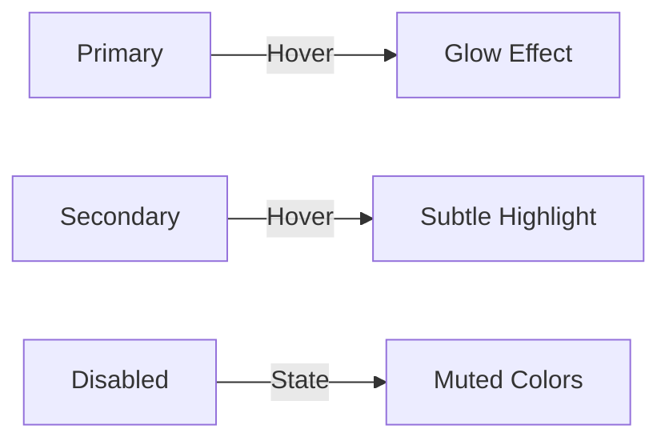
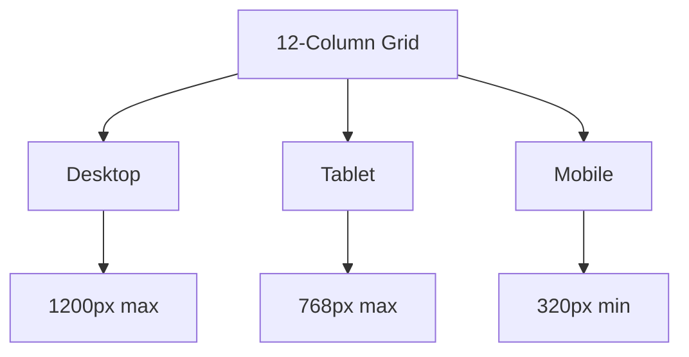
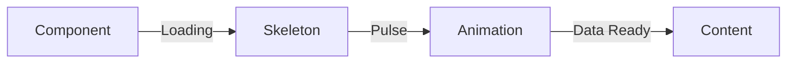

# [ PROJECT NAME ] - User Interface & Experience Specifications
*Version: 1.0.0*

## Design System

### Color Palette

```css
:root {
    /* Primary Colors */
    --primary-dark: #121212;
    --primary-bg: #1E1E1E;
    --primary-light: #2D2D2D;
    
    /* Accent Colors */
    --accent-blue: #00B4D8;
    --accent-green: #00F5D4;
    --accent-amber: #FFB800;
    
    /* Text Colors */
    --text-primary: #FFFFFF;
    --text-secondary: #B3B3B3;
    --text-disabled: #666666;
    
    /* Status Colors */
    --success: #00C853;
    --warning: #FFD600;
    --error: #FF1744;
    --info: #00B0FF;
}
```

### Typography

```css
:root {
    /* Font Families */
    --font-primary: 'Inter', sans-serif;
    --font-mono: 'Fira Code', monospace;
    
    /* Font Sizes */
    --text-xs: 0.75rem;    /* 12px */
    --text-sm: 0.875rem;   /* 14px */
    --text-base: 1rem;     /* 16px */
    --text-lg: 1.125rem;   /* 18px */
    --text-xl: 1.25rem;    /* 20px */
    --text-2xl: 1.5rem;    /* 24px */
    --text-3xl: 1.875rem;  /* 30px */
    --text-4xl: 2.25rem;   /* 36px */
}
```

### Component Design

#### Buttons


Primary Button:
- Background: var(--accent-blue)
- Text: var(--text-primary)
- Hover: Glow effect with 0 0 20px var(--accent-blue)
- Active: Darken by 10%

Secondary Button:
- Background: var(--primary-light)
- Border: 1px solid var(--accent-blue)
- Text: var(--text-primary)
- Hover: Background lighten by 5%

#### Cards
- Background: var(--primary-bg)
- Border: 1px solid var(--primary-light)
- Border Radius: 8px
- Box Shadow: 0 4px 6px rgba(0, 0, 0, 0.1)

#### Input Fields
- Background: var(--primary-dark)
- Border: 1px solid var(--primary-light)
- Focus: Border color var(--accent-blue)
- Text: var(--text-primary)
- Placeholder: var(--text-disabled)

## Layout System

### Grid System


### Spacing Scale
```css
:root {
    --space-1: 0.25rem;  /* 4px */
    --space-2: 0.5rem;   /* 8px */
    --space-3: 0.75rem;  /* 12px */
    --space-4: 1rem;     /* 16px */
    --space-6: 1.5rem;   /* 24px */
    --space-8: 2rem;     /* 32px */
    --space-12: 3rem;    /* 48px */
    --space-16: 4rem;    /* 64px */
}
```

## Responsive Design

### Breakpoints
```css
/* Mobile First Approach */
@media (min-width: 640px) { /* sm */ }
@media (min-width: 768px) { /* md */ }
@media (min-width: 1024px) { /* lg */ }
@media (min-width: 1280px) { /* xl */ }
@media (min-width: 1536px) { /* 2xl */ }
```

## Animation & Transitions

### Motion Design
- Duration: 200-300ms
- Easing: cubic-bezier(0.4, 0, 0.2, 1)
- Reduced motion support

```css
.transition-base {
    transition: all 200ms cubic-bezier(0.4, 0, 0.2, 1);
}

@media (prefers-reduced-motion: reduce) {
    .transition-base {
        transition: none;
    }
}
```

## Component Library

### Navigation
- Navbar
- Sidebar
- Breadcrumbs
- Tabs

### Forms
- Text Input
- Select
- Checkbox
- Radio
- Toggle
- Date Picker

### Feedback
- Toast Notifications
- Progress Bars
- Loading Spinners
- Error States

### Data Display
- Tables
- Cards
- Lists
- Charts
- Graphs

## Accessibility

### Standards
- WCAG 2.1 Level AA compliance
- Keyboard navigation
- Screen reader support
- High contrast support

### Focus States
- Visible focus rings
- Skip navigation links
- ARIA labels and roles

## Loading States

### Skeleton Screens


### Progress Indicators
- Linear progress for determinate operations
- Circular spinner for indeterminate operations
- Skeleton screens for content loading

## Error States

### Form Validation
- Inline validation
- Error messages
- Success states
- Helper text

### Empty States
- Helpful messages
- Suggested actions
- Visual illustrations

## Interaction Patterns

### Hover States
- Subtle background change
- Glow effects for CTAs
- Tooltip displays

### Active States
- Visual feedback
- Color changes
- Scale transforms

### Focus States
- Clear focus indicators
- Keyboard navigation
- Tab order

## Best Practices

### Performance
- Lazy loading images
- Code splitting
- Progressive enhancement
- Optimized assets

### Accessibility
- Semantic HTML
- ARIA labels
- Keyboard navigation
- Screen reader testing

### Responsiveness
- Mobile-first approach
- Fluid typography
- Flexible layouts
- Breakpoint testing
